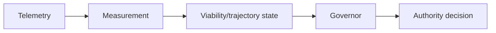

# Cohervia

The Coherence Governor for Autonomous Systems

> Core principle: Autonomous authority should not exceed demonstrated coherence.

Cohervia is a falsification-driven runtime-assurance research project investigating whether declining behavioral viability can be detected early enough for an independent governor to adjust an autonomous system's authority before consequential failure.

## Scientific status warning

> Cohervia is currently in foundation/consolidation status. It is not a validated production governor, it is not proven safe, and it does not claim validated general AI-safety performance or real-agent evidence.

## Problem statement

Autonomous systems can continue operating even when the evidence of their future viability is weakening. The research question is whether a distinct governor can recognize that drift early enough to constrain authority before a consequential failure occurs.

This project focuses on the separation of measurement, viability estimation, trajectory warning, and authority decisions. It does not assume that a candidate governor signal is sufficient to authorize action on its own.

## Compact architecture

## Candidate compact governor state

`S_t = [H_t, M_t, dM_t/dt, U_t]`

These are candidate constructs, not validated production quantities:

- `H_t`: accumulated trajectory hazard
- `M_t`: current viability margin
- `dM_t/dt`: direction and rate of viability change
- `U_t`: uncertainty and evidence quality

State viability, action authorization, observed failure, and predicted future failure are distinct concepts. A system may have low viability without a decision to deny action, and a governor may forecast future failure without a final authorization change being justified by the current evidence.

## Deterministic authority boundary

Deterministic authorization boundaries outrank probabilistic governor signals. In the intended architecture, the acting agent must not control the governor, its thresholds, telemetry, audit records, enforcement, or fallback.

## Predecessor lineages

Cohervia is the canonical successor to three predecessor research lineages without copying their implementation code. The successor relationship is documented in provenance records rather than by inheriting validation claims.

- EFGM: `https://github.com/dauffrey/efgm` at commit `37b2ff2d2b577c9f383dd0d7c3083597627150ea`
  - Evidence-backed observations, provenance, explicit applicability states, research governance, and falsification discipline.
- EFGM Artificial Homeostasis: `https://github.com/dauffrey/EFGM-artificial-homeostasis` at commit `7d67c01647a2a5305d5bf651ff2eacc8c2834d40`
  - Disturbance, reserve, recovery, viability margins, boundary measurement, counterfactual regulation, abstention, and the strongest controlled synthetic evidence.
- Coherence Governor System: `https://github.com/dauffrey/CGS` at commit `96c15ce00221879ae613ec907e69206a5037d915`
  - Independent governor architecture, trajectory warning, separation of state viability from action authorization, matched false-alarm evaluation, and graduated authority.

See the provenance documentation for the full lineage and constraints: [docs/provenance/LINEAGE.md](docs/provenance/LINEAGE.md).

## Documentation

- [docs/architecture/OVERVIEW.md](docs/architecture/OVERVIEW.md) — architecture layers and governance posture
- [docs/provenance/CONSTRUCT_STATUS.md](docs/provenance/CONSTRUCT_STATUS.md) — conservative construct status table
- [docs/provenance/LINEAGE.md](docs/provenance/LINEAGE.md) — predecessor lineages and authoritative snapshot record
- [docs/research/EVIDENCE_POLICY.md](docs/research/EVIDENCE_POLICY.md) — preregistration, freeze, and evidence rules
- [ROADMAP.md](ROADMAP.md) — phased research roadmap
- [CONTRIBUTING.md](CONTRIBUTING.md) — scientific and implementation expectations
- [SECURITY.md](SECURITY.md) — security reporting policy
- [experiments/README.md](experiments/README.md) — Cohervia experiment namespace and rules

## Status

Cohervia is in foundation/consolidation status. It contains no validated production governor, no validated general safety capability, and no claim that inherited constructs are validated simply because they were selected for a successor project.
