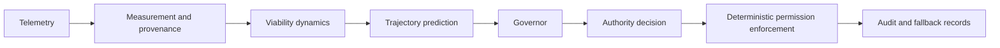

# Architecture overview

Cohervia is not a validated control policy yet. It is a research architecture intended to separate measurement, viability estimation, trajectory warning, and authority decisions so that an independent governor can be evaluated without assuming it is already trustworthy.

## Four layers

### 1. Measurement and provenance

This layer collects telemetry, records provenance, and preserves the uncertainty and applicability of each observation. It defines what was observed, what was inferred, what is unknown, and what does not apply. The system must not silently convert missing evidence to zero, and it must retain enough traceability to answer which sensor, configuration, dataset, and implementation version produced each value.

Key design expectations:

- preserve source identity and acquisition context;
- attach explicit observation states: `observed`, `inferred`, `unknown`, and `not_applicable`;
- keep experiments and holdout data separated;
- maintain audit trails for telemetry, configuration, evaluator identity, and artifact hashes;
- reject weak provenance before a signal is trusted for governance decisions.

### 2. Viability dynamics

This layer converts measurements into viability-related state estimates, such as disturbance load, reserve, recovery, and viability margin. The goal is to model how an agent or system is moving toward or away from a defined viable operating region, not to assume that any observed margin implies a particular authority decision.

Viability is an operational state estimate, not a normative safety judgment. A system may remain highly viable while taking prohibited, misaligned, or harmful actions. High viability therefore does not imply safety, policy compliance, or authorization.

This layer is responsible for:

- estimating margin over time;
- tracking rate of change in viability;
- distinguishing state viability from action authorization;
- distinguishing observed failure from predicted future failure;
- preserving uncertainty and evidence quality.

### 3. Trajectory prediction

This layer evaluates the likely future trajectory of the system under current and plausible near-term conditions. It is not the same thing as authorization. Even a strong warning signal should remain distinct from the decision to allow, challenge, limit, hold, deny, or fall back.

Design expectations:

- use matched false-alarm budgets for early-warning comparisons;
- treat counterfactual abstention as a policy option when uncertainty is high;
- keep prediction models separate from the enforcement boundary;
- avoid claiming generalization to real autonomous agents without new evidence.

### 4. Authority governance

This layer decides whether an autonomous system may continue under current authority, be constrained, or be forced into fallback or denial. It must enforce deterministic permission boundaries that are independent of any probabilistic governor signal.

The governor is not the authority source. It is a supervisory signal and decision support component. The actual permission boundary is enforced by deterministic logic that can be audited and independently checked.

## Intended flow

## Trust boundaries

The design assumes a strict separation between:

- the acting agent and the governor;
- telemetry sources and governance logic;
- observed system state and authorization decisions;
- policy thresholds and enforcement;
- research evidence and operational authority.

The acting agent must not control the governor, its thresholds, telemetry, audit records, enforcement, or fallback. A governor that is not independent is not a valid governance instrument for this research.

## Deterministic enforcement and graduated outcomes

Authorization boundaries must be deterministic and should outrank any probabilistic governor signal. The architecture anticipates graduated outcomes such as:

- `ALLOW`
- `CHALLENGE`
- `LIMIT`
- `HOLD`
- `DENY`
- `FALLBACK`

These are architectural outcomes only. They are not validated policy thresholds and must not be interpreted as completed evidence that any specific threshold is safe or effective.

## Auditability and uncertainty handling

The system must log:

- source telemetry and provenance;
- measurement assumptions and applicability states;
- viability and trajectory estimates;
- shadow-mode decisions and any gating conditions;
- final authority actions and fallback pathways.

Uncertainty should be maintained as an explicit variable rather than treated as a hidden confidence discount. The architecture is designed for shadow-mode-first deployment, where governance observations can be compared against operational outcomes without immediately exerting authority.

## Phase 1 specification contracts

The Phase 1 work is intentionally documentation-only and is recorded in the following specification artifacts:

- [MIGRATION_INVENTORY.md](../../MIGRATION_INVENTORY.md) — source-grounded migration inventory and adoption boundaries
- [OBSERVATION_CONTRACT.md](../../OBSERVATION_CONTRACT.md) — explicit semantics for measurements and observation status
- [TRAJECTORY_STATE_CONTRACT.md](../../TRAJECTORY_STATE_CONTRACT.md) — viability-state definitions and trajectory-state invariants
- [AUTHORITY_AUDIT_CONTRACT.md](../../AUTHORITY_AUDIT_CONTRACT.md) — separation of signal, authority, and audit obligations
- [PHASE_2_PLAN.md](../../PHASE_2_PLAN.md) — minimal observation-and-audit implementation plan

These contracts define the specification boundary for Cohervia's first implementation-oriented milestone without creating a runtime governance implementation.

## Deployment posture

The current intended deployment posture is shadow-mode-first. In this posture, the governor evaluates trajectories and emits advisory state without acting as the final authority. Only after controlled evidence and explicit review should intervention logic be advanced beyond observation and audit.

This architecture is foundational, not a claim of production readiness.
