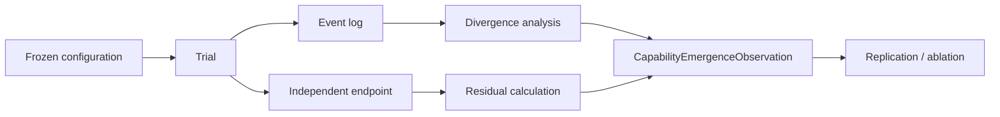

# Capability Emergence Observation

## Status

`CapabilityEmergenceObservation` is a **candidate research record**. It is not a validated sensor and must not be used as an authority signal without separate evidence.

Its purpose is to make capability-discovery claims auditable.

## Record contract

A record should answer:

1. What system configuration was tested?
2. What capability endpoint was measured?
3. What baseline predicted performance?
4. Was there a residual capability gain?
5. Where did the trajectory first materially differ?
6. Which tools, memory operations, agents, or environmental affordances were involved?
7. Were all actions authorized?
8. Was the result independently verified and reproduced?

## Required fields

| Field | Meaning |
|---|---|
| `observation_id` | Unique immutable observation identifier |
| `experiment_id` | Cohervia experiment identifier |
| `trial_id` | Unique trial/run identifier |
| `timestamp` | Observation timestamp |
| `system_configuration_hash` | Hash of the frozen system configuration |
| `model_identity` | Declared model/version identity when available |
| `capability_endpoint_id` | Frozen endpoint identifier |
| `baseline_prediction` | Predicted endpoint value before holdout exposure |
| `observed_value` | Observed endpoint value |
| `emergence_residual` | Observed minus preregistered prediction |
| `first_divergence_event_id` | Earliest event linked to the candidate change, or `unknown` |
| `tools_involved` | Tool identifiers involved |
| `memory_involved` | Whether persistent state materially participated |
| `agents_involved` | Number/identifiers of agents involved |
| `environmental_affordance` | Shared state or environmental primitive implicated, if any |
| `constraint_status` | Whether deterministic constraints remained satisfied |
| `verifier_result` | Independent verifier outcome |
| `reproduction_status` | `not_attempted`, `failed`, `partial`, `reproduced` |
| `applicability` | `observed`, `inferred`, `unknown`, `not_applicable` |
| `evidence_quality` | Bounded quality descriptor |
| `provenance_hash` | Hash binding the record to its evidence bundle |

## Interpretation rules

- A large `emergence_residual` is not sufficient to claim emergence.
- `first_divergence_event_id = unknown` must remain unknown; it must not be imputed.
- `constraint_status` is independent of task success.
- A reproduced capability may still be unsafe.
- A safe trajectory may still fail the capability task.
- Model statements about their own motives or internal state are not privileged evidence.
- Inferences about intent require separate methodology and must never be silently encoded as observations.

## Minimal lifecycle

## Schema

A machine-readable schema is maintained at:

[`schemas/capability-emergence-observation.schema.json`](../../schemas/capability-emergence-observation.schema.json)
