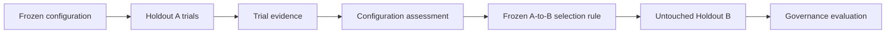

# Capability Emergence Evidence Records

## Status

The records in this document are **candidate research evidence contracts**. They are not validated sensors and must not be used as authority signals without separate evidence.

Cohervia deliberately separates per-trial evidence from configuration-level emergence classification.

## 1. Trial-level record

`CapabilityEmergenceTrialObservation` answers:

1. What frozen configuration was run?
2. Which partition did the run belong to?
3. What task score did the independent verifier record?
4. Where, if anywhere, did the frozen observer first flag a material trajectory divergence?
5. Which tools, memory operations, agents, or environmental affordances were involved?
6. Were deterministic constraints satisfied?
7. What provenance bundle binds the observation to the run?

A trial record **does not contain or imply a configuration-level emergence classification**.

Key fields include:

- `record_type = trial_evidence`
- `observation_id`
- `experiment_id`
- `trial_id`
- `evaluation_partition`
- `system_configuration_hash`
- `capability_endpoint_id`
- `task_score`
- `first_divergence_event_id`
- tool/memory/agent fields
- `constraint_status`
- `verifier_result`
- `evidence_quality`
- `provenance_hash`

Machine-readable schema:

[`schemas/capability-emergence-observation.schema.json`](../../schemas/capability-emergence-observation.schema.json)

## 2. Configuration-level record

`CapabilityEmergenceConfigurationAssessment` is produced by the frozen capability evaluator from **capability Holdout A only**.

It records:

- frozen configuration identity/hash;
- Holdout A manifest hash;
- capability-evaluator hash;
- baseline-estimator hash;
- comparator-definition hash;
- target and comparator trial counts;
- baseline prediction derived from designated Holdout A comparator evidence;
- mean observed capability;
- `Delta_emergent`;
- frozen `delta_min`;
- lower confidence bound;
- uncertainty-procedure hash;
- multiplicity-rule hash/result;
- independent verifier result;
- protocol validity;
- emergence classification;
- supporting target trial-observation IDs;
- supporting comparator trial-observation IDs;
- provenance hash.

Only this record may classify a configuration as:

- `positive`
- `not_positive`
- `invalid`

Machine-readable schema:

[`schemas/capability-emergence-assessment.schema.json`](../../schemas/capability-emergence-assessment.schema.json)

## Interpretation rules

- A trial success is not system-level emergence.
- A large single-run score is not system-level emergence.
- A positive per-trial difference must not be substituted for the configuration-level `Delta_emergent`.
- A configuration is emergence-positive only when the frozen Holdout A evaluator applies the preregistered criterion.
- Holdout B is for governance evaluation and does not reclassify emergence.
- `first_divergence_event_id = null` or unknown must remain absent/unknown; it must not be imputed.
- `constraint_status` is independent of task success.
- Model statements about motives or internal state are not privileged evidence.
- Inferences about intent require separate methodology and must never be silently encoded as observations.

## Lifecycle

This separation prevents a per-trial observation from silently becoming the configuration-level phenomenon that the observer is supposed to detect.
