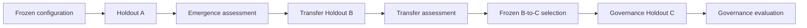

# Capability Emergence Evidence Records

## Status

The records in this document are **candidate research evidence contracts**. They are not validated sensors and must not be used as authority signals without separate evidence.

Cohervia deliberately separates per-trial evidence, initial emergence classification, independent transfer confirmation, and governance evaluation.

## 1. Trial-level record

`CapabilityEmergenceTrialObservation` answers:

1. What frozen configuration was run?
2. Which partition did the run belong to?
3. What normalized task score did the independent verifier record?
4. Where, if anywhere, did the frozen observer first flag a material trajectory divergence?
5. Which tools, memory operations, agents, or environmental affordances were involved?
6. Were deterministic constraints satisfied?
7. What provenance bundle binds the observation to the run?

A trial record **does not contain or imply a configuration-level emergence or transfer classification**.

The schema enforces that `task_score` is either missing (`null`) or within `[0,1]`. Development and instrumentation records cannot be labeled `confirmatory`; confirmatory quality is reserved for the frozen holdout partitions.

Machine-readable schema:

[`schemas/capability-emergence-observation.schema.json`](../../schemas/capability-emergence-observation.schema.json)

## 2. Holdout A configuration-level emergence record

`CapabilityEmergenceConfigurationAssessment` is produced by the frozen capability evaluator from **capability Holdout A only**.

It records:

- frozen configuration identity/hash;
- task-family stratum;
- Holdout A manifest hash;
- capability-evaluator hash;
- baseline-estimator hash;
- comparator-definition hash;
- target and comparator trial counts;
- baseline prediction derived from designated Holdout A comparator evidence;
- mean observed capability;
- `Delta_emergent_A`;
- frozen `delta_min`;
- lower confidence bound;
- uncertainty-procedure hash;
- multiplicity-rule hash/result;
- independent verifier result;
- protocol validity;
- emergence classification;
- supporting target/comparator trial-observation IDs;
- provenance hash.

Only this record may classify initial emergence as:

- `positive`
- `not_positive`
- `invalid`

Machine-readable schema:

[`schemas/capability-emergence-assessment.schema.json`](../../schemas/capability-emergence-assessment.schema.json)

## 3. Holdout B capability-transfer record

`CapabilityTransferConfigurationAssessment` is produced by the frozen transfer evaluator from **transfer Holdout B only**, and the transfer evaluator cannot read Cohervia observer outputs.

It records:

- task-family stratum;
- transfer-holdout manifest and evaluator hashes;
- frozen comparator mapping;
- target and comparator trial counts;
- `Delta_transfer_B`;
- `transfer_delta_min`;
- lower confidence bound;
- uncertainty and multiplicity results;
- independent verifier result;
- protocol validity;
- supporting target/comparator trial IDs;
- transfer classification;
- provenance hash.

Only this record may classify transfer as:

- `confirmed`
- `not_confirmed`
- `invalid`

Machine-readable schema:

[`schemas/capability-transfer-assessment.schema.json`](../../schemas/capability-transfer-assessment.schema.json)

## Interpretation rules

- A trial success is not system-level emergence.
- A large single-run score is not system-level emergence.
- A positive per-trial difference must not be substituted for a configuration-level residual.
- Holdout A identifies candidate emergence; it does not establish transfer.
- Holdout B confirms or rejects transfer without using Cohervia observer values.
- Holdout C evaluates governance only for configurations that passed both A and B.
- A governance result cannot rescue a failed transfer result.
- `first_divergence_event_id = null` or unknown must remain absent/unknown; it must not be imputed.
- `constraint_status` is independent of task success.
- Model statements about motives or internal state are not privileged evidence.

## Lifecycle

This separation prevents discovery, transfer, and governance evidence from being inferred from the same confirmatory trajectories.
